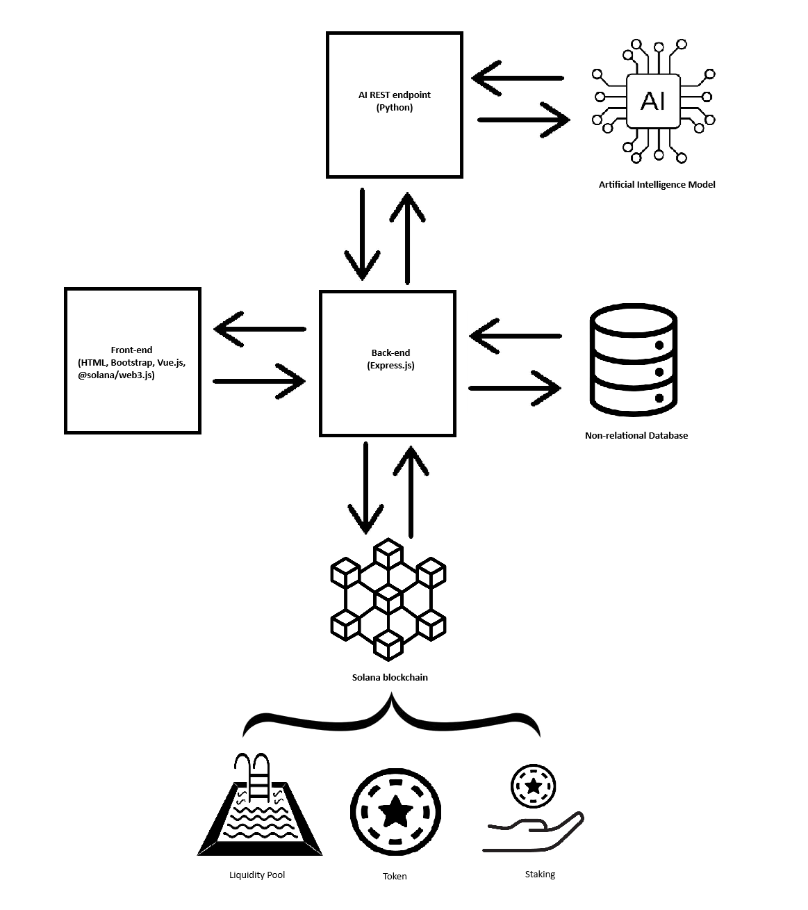

<h1 align="center">💧 Water Credit 💧</h1>

🏠 Hosted on: <a href="#"></a><br/>

> <br/><b>Water credit</b> is a project uses blockchain technology to promote water saving among companies and individuals.<br/>
> The following demo of the project proposes users to test the following features:
>
> <ul>
> <li>Loading of bills; </li>
> <li>Extraction of relevant data from the documents through AI; </li>
> <li>Calculating the amount of tokens based on the comparison and relative savings between the two bills; </li>
> <li>Minting the amount of tokens calculated in the user's wallet. </li>
> <ul><br/>

# Deployed Token Address

<br/>
<table>
  <tr>
    <th style="border: 1px solid white; padding: 8px;">Symbol</th>
    <th style="border: 1px solid white; padding: 8px;">Decimals</th>
    <th style="border: 1px solid white; padding: 8px;">Network</th>
    <th style="border: 1px solid white; padding: 8px;">Address</th>
    <th style="border: 1px solid white; padding: 8px;">Active</th>
  <tr>
  <tr style="text-align:center; vertical-align:middle; padding: 8px;">
    <td style="border: 1px solid white;">WCT</td>
    <td style="border: 1px solid white;">6</td>
    <td style="border: 1px solid white;">Solana Devnet</td>
    <td style="border: 1px solid white;"><a href="https://explorer.solana.com/address/D6PQusi8y83BqMoYWMvFNM1CXhuMtz8MrJdRHYNdBFHX?cluster=devnet" style="color:blue; text-decoration:underline; text-shadow: 1px 1px white;">D6PQusi8y83BqMoYWMvFNM1CXhuMtz8MrJdRHYNdBFHX</a></td>
    <td style="border: 1px solid white;">🟢</td>
  <tr>
</table><br/>

# Architecture

<div style="display: flex; justify-content: center;">
  
</div>
<br/>
The application architecture includes four interdependent layers:<br/>
<ul>
<li><b>Front-end</b>: structured with multiple frameworks, the layer interfaces directly with the user;<br/></li>
<li><b>Backend</b>: managed with Express.js, the layer implements business logic and data processing;<br/></li>
<li><b>Database</b>: The layer in question is essential for storing data. To improve the scalability and availability of data in the first phase, we chose to use and implement MongoDB;<br/></li>
<li><b>Integration</b>: In this layer the artificial intelligence model used is called "CohereForAI/c4ai-command-r-plus" and is used for data extraction;<br/></li>
<li><b>Integration</b>: The second level of integration involves direct connection to the Solana blockchain to be able to carry out on-chain operations such as token minting, liquidity pools and staking.<br/></li>
</ul>

# Usage

WaterCredit uses different projects for implement the functionalities that described in the first section of this file.
For configure and use correctly them you must follow the following steps: <br/>

<h3>Water Credit AI</h3>
The AI project developed by Python programming language and use these main depedencies:
<ul>
  <li>Solana.py;</li>
  <li>Pymongo;</li>
  <li>FastAPI.</li>
</ul>
<u>NOTE: We recommend to use Pycharm Community version for set and launch the project.</u>

For configure this project, you must following these commands for running it correctly:<br/>
Move into ai folder project and run this command for install dependencies using requirements.txt file:<br/>

```sh
pip install -r requirements.txt
```

Then you must create 'seed.txt' file inside project root which it must contain the private key converted into UInt8Array about your Solana wallet.
E.g.:

```sh
[43, 102, 231, 20, 48, 210, ...]
```

After made previous steps, the next one is to create '.env' file for set the following settings:

> <br/>
> HF_CHAT=[your_HuggingChat_cookie]<br/>
> MINT_TOKEN_ADDRESS=[token_address_Solana_Testnet]<br/>
> MOCK_AI=OFF<br/>
> MOCK_NUMBER_ITEM='1'<br/>
> MONGODB_URL=[Your MongoDB url]<br/>
> <br/>
<br/>
The paremeters MOCK_AI and MOCK_NUMBER_ITEM work together when the first parameter set to "ON" value. That means that it will mock the response from AI.
The value of MOCK_NUMBER_ITEM must be initialized to '1'.
For HuggingChat, you must sign up on HuggingChat website and into browser do a right click, click on "Inspect" and go to "Application" tab.
At this point you can see the key like that "hf-chat" and related value. You must copy that value and put inside '.env' file into HF_CHAT key.<br/><br/>

⚠️ <u><b>We remember that this project it's only for academic study. We didn't take any responsability of damages that you could make with this code on HuggingChat website.</b></u> ⚠️

The last step is to launch the FastApi server and for do it you must run this command into terminal of the folder project:

```sh
fastapi run main.py
```

<h3>Water Credit Back End</h3>
The back-end project uses these main depedencies:
<ul>
  <li>ExpressJS;</li>
  <li>MongoDB.</li>
</ul>

In the first time that you're configuring this project, you must following these commands for running it correctly:<br/>
Move into back-end folder project and run this command for install the dependencies:

```sh
npm install
```

At this point you must create '.dotenv' file for set some settings for launch correctly the server.
This configuration file must contain the following keys with related values:

> <br/>
> ENDPOINT=http://localhost<br/>
> APPLICATION_PORT=[Replace with your port]<br/>
> ENDPOINT_PY=http://localhost<br/>
> PY_PORT=[Replace with the port that currently running the water-credit-ai project]<br/>
> MONGODB_URL=[Your MongoDB url]<br/>
> <br/>

Then for running ExpressJS server, not in reloading mode, you can run the following command:

```sh
npm run server
```

If you want running ExpressJS server, in reloading mode, you can the following command:

```sh
npm run server-reloading
```

<h3>Water Credit Front End</h3>
The front-end project developed by Javascript programming language and use these main depedencies:
<ul>
  <li>Vue.js</li>
  <li>Bootstrap</li>
</ul>

In the first time that you're configuring this project, you must following these commands for running it correctly:<br/>
Move into front-end folder project and run this command for install the dependencies:

```sh
npm install
```

For running Vue.js server, you can run the following command:

```sh
npm run dev
```

## Author

👤 [@Kerry1207](https://github.com/Kerry1207)
👤 [@SamuelePassiatore](https://github.com/SamuelePassiatore)

## 📝 License

This project is [MIT](https://github.com/Kerry1207/WaterCredit/blob/main/LICENSE) licensed.
